  

# Olá, eu sou o Jonathan 👋

Desenvolvedor full-stack. Construo sistemas que conectam APIs, automatizam processos e colocam a inteligência artificial para resolver problemas reais, do backend ao app mobile.

Gosto de cuidar do projeto inteiro: arquitetura, integração entre serviços, deploy e manutenção. Uso IA no dia a dia como ferramenta de desenvolvimento, sempre com revisão técnica, para entregar mais rápido sem abrir mão da qualidade.

---

<table>
  <tr>
    <td align="center" width="140">
      
       JavaScript
    </td>
    <td align="center" width="140">
      
       TypeScript
    </td>
    <td align="center" width="140">
      
       Python
    </td>
    <td align="center" width="140">
      
       Node.js
    </td>
    <td align="center" width="140">
      
       React
    </td>
    <td align="center" width="140">
      
       React Native
    </td>
  </tr>
  <tr>
    <td align="center" width="140">
      
       Expo
    </td>
    <td align="center" width="140">
      
       Android Studio
    </td>
    <td align="center" width="140">
      
       Express
    </td>
    <td align="center" width="140">
      
       Vite
    </td>
    <td align="center" width="140">
      
       Tailwind CSS
    </td>
    <td align="center" width="140">
      
       Git
    </td>
  </tr>
  <tr>
    <td align="center" width="140">
      
       MySQL
    </td>
    <td align="center" width="140">
      
       MongoDB
    </td>
    <td align="center" width="140">
      
       Redis
    </td>
    <td align="center" width="140">
      
       Docker
    </td>
    <td align="center" width="140">
      
       Nginx
    </td>
    <td align="center" width="140">
      
       AWS
    </td>
  </tr>
</table>

### 🔗 Integrações e ferramentas

- REST APIs e integração entre sistemas
- tRPC
- Drizzle ORM
- AWS S3
- WhatsApp e Baileys
- Meta WhatsApp API
- React Native WebRTC
- Vitest
- esbuild
- pnpm

---

## 👨‍💻 No que eu trabalho

- 🔗 **Integrações:** conecto APIs e sistemas para que os dados fluam sem trabalho manual.
- 🤖 **IA aplicada:** chatbots e automações que rodam em produção, não só protótipos.
- 🌐 **Web:** React, Vite e Tailwind no front; Node.js e Express no back.
- 📱 **Mobile:** apps com React Native e Expo para Android, iOS e Web.
- 🐳 **Infra:** Docker, Redis e MySQL, com deploy em VPS.

---

## 🚀 Projetos e experiências

### 🤖 Central de Atendimento — Liberty

Aplicação web e backend para gerenciamento de atendimento e comunicação via WhatsApp.

- Backend em Node.js e Express.
- Frontend em React e Vite.
- API compartilhada com tRPC.
- Persistência de dados com MySQL e Drizzle ORM.
- Redis para comunicação entre processos e filas de trabalho.
- Integração com WhatsApp e Baileys.
- Integrações com serviços de armazenamento S3.
- Docker para execução dos serviços.

### 📱 Liberty App

Aplicativo mobile desenvolvido com React Native e Expo.

- React Native e Expo.
- TypeScript.
- React Native WebRTC.
- Notificações e recursos nativos.
- Suporte a Android, iOS e Web.
- Build e execução com Docker e Nginx para a versão web.

### 🔗 Integrações e automações

Experiência com desenvolvimento de soluções que conectam APIs, processam dados e automatizam tarefas, buscando melhorar fluxos de trabalho e comunicação entre sistemas.

---
