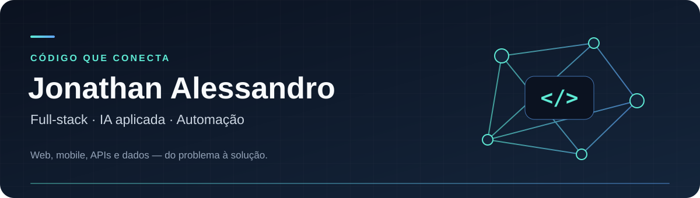

  

# Olá, eu sou o Jonathan 👋

**Desenvolvedor full-stack com foco em integrações, IA aplicada e automação.**

Construo sistemas de atendimento, aplicações web e mobile e ferramentas que transformam documentos e dados em informação útil. Trabalho com TypeScript, JavaScript, Python e Kotlin, conectando interfaces, APIs, bancos de dados e serviços externos.

Meus projetos incluem comunicação via WhatsApp, plataformas com isolamento por empresa, consulta documental com IA e processamento de dados em lote. Gosto de acompanhar o fluxo completo: modelagem, implementação, testes, implantação e manutenção.

## 🛠️ Tecnologias

  

- **Web e APIs:** React, Node.js, Express, tRPC, TanStack Query, Tailwind CSS e Drizzle ORM.
- **Mobile:** React Native, Expo, WebRTC e Android nativo com Jetpack Compose.
- **Dados e infraestrutura:** PostgreSQL, MySQL/MariaDB, Redis, Docker e armazenamento compatível com S3, incluindo MinIO e Cloudflare R2.
- **IA e documentos:** integração com LLMs, recuperação de contexto documental, OCR com Tesseract e extração de PDFs e planilhas.
- **Integrações e qualidade:** Meta WhatsApp Cloud API, Baileys, Listmonk, Playwright e Vitest.

## 🚀 Projetos em destaque

### 💬 Sprint / Central — atendimento para múltiplas empresas

Plataforma de atendimento com painel React, API Express/tRPC e processamento assíncrono de mensagens.

- Isolamento por empresa com PostgreSQL, Row-Level Security e permissões de acesso.
- Integração com Meta WhatsApp Cloud API e sessões vinculadas por QR com Baileys.
- Workers independentes, filas persistidas no PostgreSQL e sinais entre processos via Redis.
- Atualizações por SSE, auditoria de suporte, retenção de mídias e backups em S3.
- Frontend de apresentação e autenticação separado, integrado à mesma API.

**Stack:** TypeScript · React · Express · tRPC · PostgreSQL · Drizzle · Redis · Docker

### 📞 Liberty SAC — central de comunicação

Sistema de atendimento que reúne conversas, filas, contatos, chamadas, relatórios e administração de usuários.

- WhatsApp via Cloud API, coexistência oficial e dispositivo vinculado por QR.
- Perfis e cargos personalizados, histórico, auditoria e atualizações em tempo real.
- Processamento de mensagens em workers e armazenamento de mídias e backups no Cloudflare R2.
- API compartilhada com o aplicativo móvel Liberty App.

**Stack:** TypeScript · React · Node.js · tRPC · MySQL · Redis · Cloudflare R2

### 📱 Mobile — Liberty App e Central Android

Duas abordagens para levar o atendimento ao celular:

- **Liberty App:** React Native e Expo, com conversas, envio de mídias, notificações por SSE, armazenamento seguro da sessão e áudio de chamadas via WebRTC.
- **Central Android:** Kotlin e Jetpack Compose, com seleção de empresa, filas, histórico, envio de anexos e sessão cifrada com Android Keystore.

**Stack:** React Native · Expo · TypeScript · WebRTC · Kotlin · Jetpack Compose

### 🤖 LibertyAI — consulta a uma base documental

Chat que indexa PDFs, imagens e planilhas para responder perguntas com contexto e indicação das fontes.

- Extração de texto, reconstrução de tabelas, OCR e leitura visual seletiva de PDFs.
- Respostas diretas para correspondências estruturadas exatas e uso de LLM para interpretação.
- Ingestão por upload ou pasta monitorada, autenticação e histórico por usuário.
- Persistência em MariaDB e armazenamento de documentos em MinIO/S3.

**Stack:** TypeScript · React · Express · tRPC · LLMs · Tesseract · MariaDB · MinIO

### ⚙️ Integrações e automação de dados

- **Enrich CNPJ:** pipeline Python para enriquecimento cadastral via BrasilAPI, descoberta de sites e contatos públicos, deduplicação, retomada de lotes e validação passiva de e-mails.
- **Automação comercial:** API Node.js para cadastro e sincronização de clientes com Listmonk, integração com CRM e workers de SMS e acompanhamento via WhatsApp.
- **Coleta de catálogos:** Node.js e Playwright para extrair produtos de supermercados, normalizar preços, deduplicar registros e persistir em MySQL.
- **Transcrição de documentos:** aplicação para processar cartões de ponto e holerites em PDF, com OCR, revisão em tabela e exportação para Excel.

## 🎯 Como trabalho

- Contratos tipados e separação de responsabilidades entre interface, API e serviços.
- Autenticação, permissões e isolamento de dados como parte da arquitetura.
- Processamento assíncrono para mensagens, documentos e tarefas em lote.
- Testes de regras de negócio, integrações e fluxos de interface.
- Uso de IA como ferramenta de desenvolvimento, com revisão do código e validação das mudanças.
